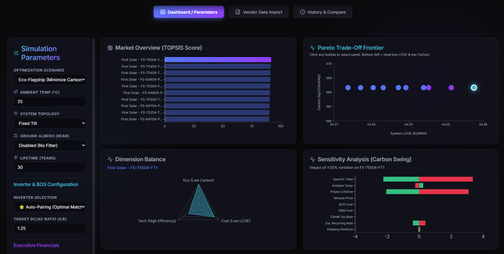
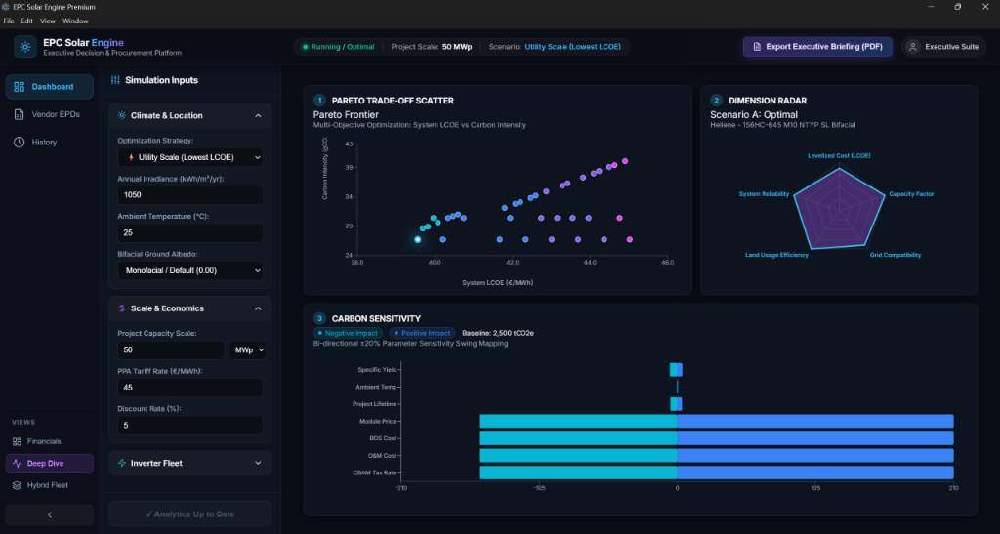
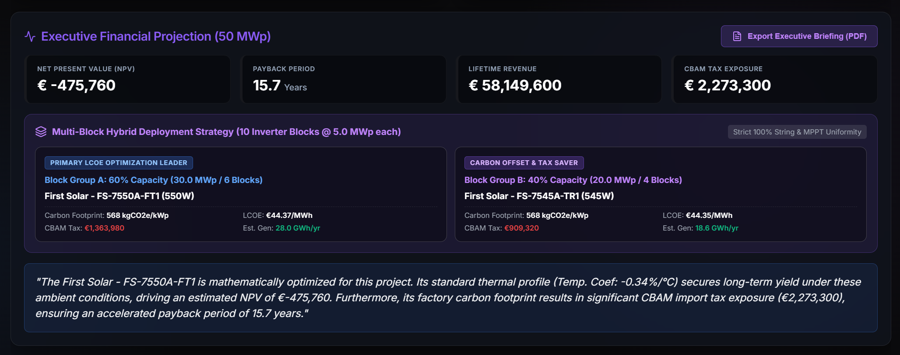
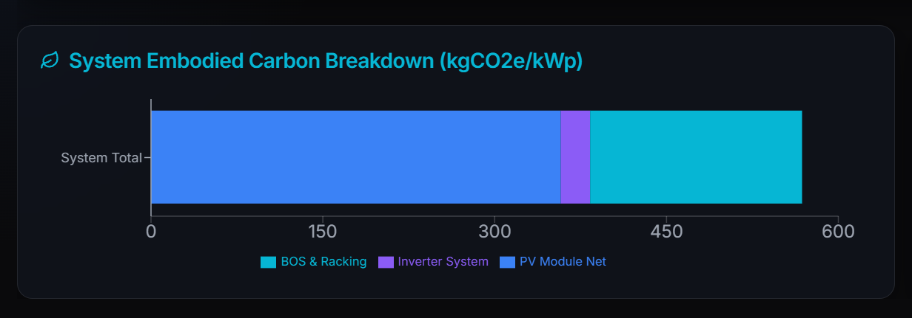
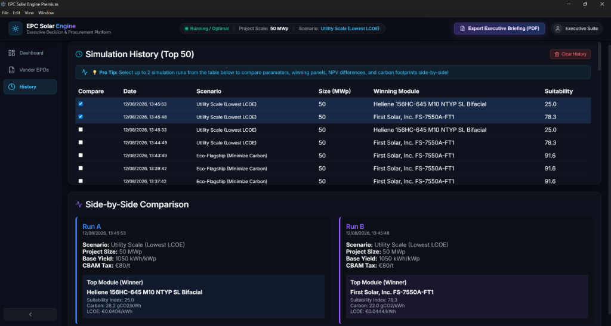

# EPC Solar Engine ⚡  
### *Executive Decision Support & Utility-Scale PV Life Cycle Assessment Engine*


---

## 🌟 Executive Overview

**EPC Solar Engine** is an open-source, full-stack decision-support and procurement optimization platform designed for **Solar Project Developers, Independent Power Producers (IPPs), and EPC Engineering Firms**.

Unlike traditional engineering software (like PVsyst or Helioscope) that focuses solely on electrical sizing, EPC Solar Engine combines **SAM PV performance modeling, PyArrow-accelerated EPD Scope 3 Life Cycle Assessment (LCA), and Multi-Criteria Decision Analysis (TOPSIS)** into a single executive interface. It empowers C-suite executives and procurement directors to evaluate PV modules across **LCOE (€/MWh), Net Present Value (NPV), Payback Period, and Scope 3 Embodied Carbon (kgCO2e/kWp)** simultaneously.



---

## ✨ Visual Feature Deck

### 1. 💼 Executive Financial Dashboard & C-Suite Pitch Generator
- **Real-Time KPI Sparklines:** Live scaling of **30-Year Net Present Value (NPV)**, **Accelerated Payback Period**, and **Lifetime Project Revenue**.
- **Automated C-Suite Executive Pitch:** Generates contextual procurement briefings evaluating thermal coefficients, degradation rates, and CBAM tax exposure.
- **Top TOPSIS Ranking Matrix:** Ranks competing global module models based on user-defined optimization scenarios (*Eco-Flagship, Lowest LCOE, Max Efficiency*).


---

### 2. 🔬 Deep-Dive Physics & Environmental Analytics
- **Pareto Trade-Off Frontier Scatter:** Multi-objective frontier mapping System LCOE vs Carbon Footprint with deterministic micro-jittering and dynamic rank color palettes.
- **5-Point Dimension Radar:** Evaluates LCOE, Capacity Factor, Grid Compatibility, Land Usage Efficiency, and System Reliability.
- **Carbon Footprint Tornado Sensitivity:** Bi-directional ±20% swing analysis mapping sensitivity across temperature coefficients, degradation, CBAM tariffs, and BOS costs.



---

### 3. 🏢 Multi-Block Fleet Sizing & Hybridization Strategy
- **Sub-Array Fleet Allocation:** Splits utility-scale projects into customizable block groups (e.g. Block Group A 70% LCOE Leader vs Block Group B 30% Carbon Offset).
- **Auto-Paired Inverter Fleet:** Matches central & string inverter fleets with MPPT voltage window and DC/AC ratio compliance validation.



---

### 4. 📊 Scope 3 Embodied Carbon Stack & System Breakdown
- **Granular Lifecycle Mapping:** Breaks down embodied carbon emissions across PV module manufacturing (A1-A3 Net), central/string inverters, and BOS racking/cabling infrastructure.



---

### 5. ⏱️ SQLite Simulation History, Tagging & Delta Analytics
- **Automatic History Logging:** Every executed simulation scenario is saved locally to an embedded SQLite database (`sim_history.db`) with custom project naming and metadata tags.
- **Side-by-Side Scenario Comparison:** Select any 2 simulation runs to compare parameters, NPV gains, payback timelines, and Scope 3 carbon reduction side-by-side.
- **Variance Delta Badges:** Real-time percentage badges showing exact LCOE shifts, carbon savings %, and TOPSIS score changes between procurement scenarios.



---

### 6. ⚙️ Real-World Area-Dependent BOS & Regional Trade Engine
- **Area-Dependent BOS Coupling Law:** Couples civil ground grading, racking steel, piling, land lease, and DC cabling costs to module efficiency ($\eta$). High-efficiency TOPCon/HJT modules (22–24.5%) receive legitimate €0.03–€0.06/Wp civil cost savings per MWp.
- **Regional Trade Policy Sieve:** Instant preset switching between European Union (CBAM €80/t enforcement), North America (US / IRA market pricing), and Global/APAC utility markets.
- **Global Multi-Currency Switcher:** Full executive financial calculations supported across **EUR (€)**, **USD ($)**, **GBP (£)**, and **AUD (A$)**.
- **Technology Architecture Filter:** Dedicated procurement filters for **N-Type TOPCon & HJT**, **Bifacial Glass-Glass Fleets**, **Thin-Film (CdTe/CIGS)**, and **Low-Carbon Certified** modules.

---

## 🗺️ Industrial Viability Roadmap

To advance the EPC Solar Engine from an executive decision platform into an indispensable, day-to-day engineering tool for EPCs and IPPs, the following industrial capabilities are actively slated:

| Priority | Industrial Feature | Strategic Value to EPCs & IPPs |
| :--- | :--- | :--- |
| **P1** | **Battery Storage (BESS) Co-Location** | Model AC/DC-coupled BESS (LFP vs Sodium-ion), round-trip efficiency, Levelized Cost of Storage (LCOS), and battery Scope 3 embodied carbon. |
| **P2** | **8,760-Hr Vectorized Yield & TOU Tariffs** | Chronological hourly simulation supporting PVGIS/TMY3 weather files, clipping analysis, and Time-of-Use tariff revenue optimization. |
| **P3** | **PVsyst & CAD Interoperability (`.PAN` / `.OND` Export)** | 1-Click generation of `.PAN` (module) and `.OND` (inverter) definition files for seamless drag-and-drop into PVsyst, PlantPredict, and AutoCAD. |
| **P4** | **Bankability & Tier-1 BloombergNEF Certification** | Direct integration of BloombergNEF Tier-1 manufacturing rankings, financial solvency indices, and PVEL reliability scorecard badges. |

```
                               ┌─────────────────────────────────────────┐
                               │       REACT 19 + VITE FRONTEND          │
                               │ (Executive Financial, Analytics, Fleet) │
                               └────────────────────┬────────────────────┘
                                                    │ REST API / JSON
                               ┌────────────────────▼────────────────────┐
                               │           FASTAPI BACKEND               │
                               └──────┬───────────────────────┬──────────┘
                                      │                       │
                ┌─────────────────────▼──────┐         ───────▼────────────────┐
                │   MCDA TOPSIS ENGINE       │         │  PYARROW EPD ENGINE   │
                │ (Vector Normalization)     │         │ (SAM CEC Parquet Data)│
                └─────────────────────┬──────┘         └───────┬───────────────┘
                                      │                       │
                               ┌──────▼───────────────────────▼──────────┐
                               │  REPORTLAB EXECUTIVE PDF & SQLITE DB    │
                               └─────────────────────────────────────────┘
```

- **Backend:** Python 3.13, FastAPI, pandas, NumPy, PyArrow (Parquet predicate pushdown filtering), ReportLab 4.x (Automated 2-Page Executive PDF Briefing Engine), SQLite.
- **Frontend:** React 19, Vite, Recharts 2.x, Lucide Icons, Vanilla CSS Design System with dark glassmorphism tokens.
- **Compilation:** Standalone Windows Portable Distribution compiled with **Nuitka 2.6**.

---

## ⚡ Installation & Quickstart

### 🚀 Option 1: 1-Click Native Desktop Application (Zero Setup Required)
1. Download the latest **[EPC_Solar_Engine_v0.4.1_Windows.zip](https://github.com/Realsinister/epc-solar-engine/releases)** release package (76 MB).
2. Extract the `.zip` archive to any folder on your PC.
3. Double-click **`EPC_Solar_Engine.exe`**.
4. The software launches immediately as a **standalone native desktop application window** with zero browser tabs, zero web setup, and zero dependencies required!

---

### 🛠️ Option 2: Developer Setup (Building from Source)

#### Prerequisites
- Python 3.10+
- Node.js 18+

#### 1. Clone & Set Up Backend
```bash
git clone https://github.com/Realsinister/epc-solar-engine.git
cd epc-solar-engine/backend

# Create virtual environment & install dependencies
python -m venv .venv
.venv\Scripts\activate  # On Linux/macOS: source .venv/bin/activate
pip install -r requirements.txt

# Start FastAPI server
uvicorn api:app --port 8000 --reload
```

#### 2. Set Up & Launch Frontend
```bash
cd ../frontend
npm install
npm run dev
```

Open your browser at `http://localhost:5173`.

---

## 📄 License & Open-Core Model

This project is licensed under the **GNU Affero General Public License v3.0 (AGPL-3.0)**. 

### Open Source Core Features:
- Full MCDA TOPSIS calculation engine.
- SAM CEC PV performance physics & Scope 3 EPD carbon accounting.
- Custom vendor EPD dataset upload (.csv and .xlsx).
- Executive financial dashboards & ReportLab PDF report generation.

---

## 👤 Author & Contact

**Developed by Yash**  
- **GitHub:** [@Realsinister](https://github.com/Realsinister)
- **Project Domain:** Renewable Energy Engineering & Software Architecture
